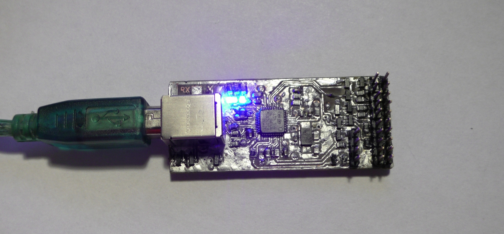

# stlinkv2
ST-link V2 schematic and PCB in kiCAD with initial firmware through UART.
1. PCB templates for prototyping at home are photoresist.svg and lut.svg, also you can convert PCB to any of appropriate formats using KiCAD.
2. As you seen above, for this solution you do not need any other st-link, you need only usb-uart adapter.
3. When you got a board, pull up pin 44 BOOT0 to Vbus by R4 resistor, so after power connect the MCU starts up from the UART bootloader.
4. Power up board by USB and connect it to your PC through UART by RX and TX pads.
5.Write dummy firmware from STLinkV2_bin.zip using the flasher utility (ST UM0462).
6. Return pull down resistor to pin 44 BOOT0 (change location of 10-100K resistor from R4 to R5 place).
7. Then connect it to USB and write the firmware from ST using upgrade utility stlink-V2.J21.S4.zip. Now you got a working st-link clone.
On the linux using the Virtualbox software this method is working too.

